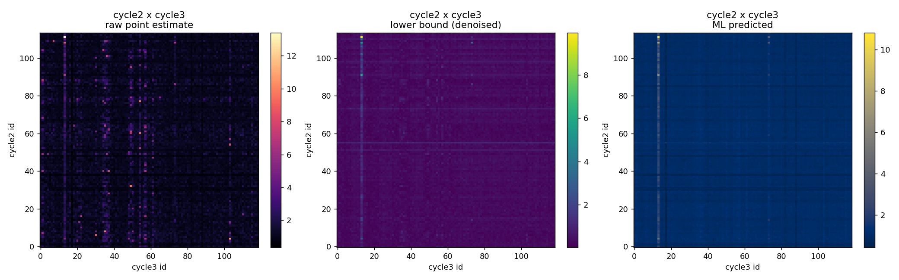

# DNA-encoded library hit finding: from raw counts to prioritized chemistry

A reproducible, laptop-friendly workflow that takes a DNA-encoded library (DEL) screen from raw sequencing counts to a ranked shortlist of building blocks, demonstrated on the public **DD1S CAIX** dataset.

The notebook reimplements the core of a published DEL analysis method in a modern Python stack so it runs on a commodity CPU, and builds a full analysis around it: the library's combinatorial structure, its building blocks, three ways to turn counts into enrichment, disynthon heatmaps, and an honest comparison of the methods.



## What it does

Starting from per-compound protein-selection and control read counts, the notebook:

1. Characterizes the library (three cycles; 8, 114 and 119 building blocks; fully enumerated to 108,528 compounds) and shows where the structural diversity lives.
2. Recovers the building blocks: cycle 2 and cycle 3 as R groups (full galleries), and cycle 1 (the central ring, varying by ring size and stereochemistry) drawn in context.
3. Turns counts into enrichment three ways: a raw Anscombe-corrected ratio, a Poisson **lower bound** that denoises low-count flukes, and a **structure-based neural model** trained with a probabilistic loss on the raw counts.
4. States plainly what "ground truth" means here (there is none beyond the counts; true confirmation needs resynthesis and assay).
5. Builds disynthon heatmaps for each method and ranks the top building blocks.
6. Concludes honestly, including a negative result for the model.

## Key findings

- The Poisson **lower bound is a simple, effective denoiser**: it demotes lucky low-count compounds below genuine high-count signal.
- SAR concentrates in the **cycle 2 x cycle 3 combinations**; cycle 1 barely affects enrichment.
- All three methods rank **cycle 3 building block id 14** at the top; the lower bound and the model also agree on cycle 3 ids 74, 58, 55 and cycle 2 ids 56, 114.
- **Honest negative result:** the structure-based model adds little predictive value on this screen, tracking the measured signal only weakly, consistent with the source paper's finding of no benefit for extrapolation to new chemistry. On this screen the statistics alone are enough to rank what was screened.

## Files

```
DD1S_DEL_analysis.ipynb   the full analysis, with narrative and embedded outputs
data/DD1S_CAIX_QSAR.csv   raw count data (from del_qsar, MIT-licensed)
figures/                  the figure shown above
requirements.txt          CPU environment (numpy pinned <2 for PyTorch on Intel macOS)
LICENSE                   MIT
```

## Running it

```
conda create -n del python=3.11 -y
conda activate del
pip install -r requirements.txt
jupyter notebook DD1S_DEL_analysis.ipynb
```

Everything runs in seconds except the model cell, which trains a 1024-bit model the first time (a few minutes on a laptop). The data path is set to `data/DD1S_CAIX_QSAR.csv`, so no other setup is needed.

## Attribution

Method and data: Lim, Reidenbach, Hua, Mason, Gerry, Clemons, Coley, "Machine learning on DNA-encoded library count data using an uncertainty-aware probabilistic loss function," *Journal of Chemical Information and Modeling*, 2022 (`github.com/coleygroup/del_qsar`, MIT License). The enrichment statistics and probabilistic loss follow that work; the workflow, building-block analysis, heatmaps and comparisons here are my own. The notebook was developed with the assistance of Claude (Anthropic) for coding and drafting; the analysis choices, validation and conclusions are mine.
